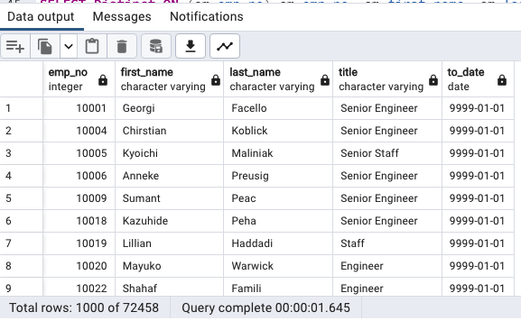
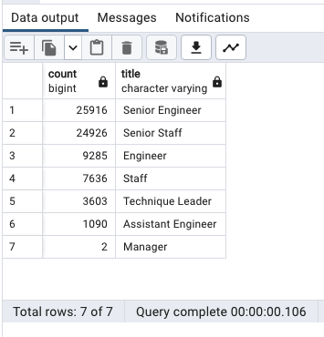
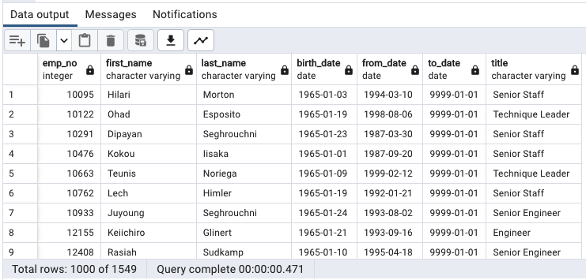

# Pewlett-Hackard-Analysis

## Overview of the analysis
This challenge consists of two technical analysis deliverables and a writte report. Analysis on number of retiring employees by title. Employees eligible for the mentorship program. Focusing on our knowlodge and skills of data modeling, engineering, and analysis.

## Results
The ERD is a diagram that mimicks relationships in Pewlett Hackard employee databases. After that we use PostgreSQL and PgAdmin to create SQL schema, tables, and attributes based on our ERD, and finally we wrote some SQL queries for exploring the employee database. 

### For Deliverable 1 
- SQL query, which included WHERE (employees.birth_date BETWEEN '1952-01-01' AND '1955-12-31') and ORDER BY clauses, was used to build a Retirement Titles table consisting of employees who are born between January 1, 1952 and December 31, 1955. We exported the Retirement Titles table as a csv file retirement_titles.csv in the database folder. The table contained 133776 titles because some employees could have several titles during their tenure at the company, for example Table 1.
- SQL query, which included DISTINCT ON (emp_no) on top of WHERE (to_date = '9999-01-01') clause, was applied to filter and generate a Unique Titles table containing the employee number, first and last name, and most recent title of the current employees. We exported the Unique Titles table as a csv file unique_titles.csv in the database folder. There were 72458 unique titles of those employees who were retiring and Table 2 showed a few of them.
- Excuted a SQL query, COUNT(emp_no), GROUP BY title and ORDER BY count DESC clauses, to summarize the aggregate number of retiring employees by title and sort the count column in descending orde. Then exported CSV file saved as retiring_titles.csv in the database folder. Table 3 suggested that more than 70% of the total employees who were retiring were either Senior Engineers (25916 employees) or Senior Staffs (24926 employees). Only 2 of the retirement-ready employees were Managers.

 

^Unique Titles

^Retiring Titles

### For Deliverable 2 
This is to generate list of employees who were eligible for the mentorship program. By joining employees employees, dept_emp, and titles. Resused with Distint ON (emp_no) to fileter the resulting table in certain order. 
- The results revealed that 1549 employees were eligible for the mentorship program in CSV file and the first 10 employees in the list.
## Summary
All Deliverables have been completed and summarized without any problems. Though the huge gaps between numbers of retirement-ready employees and mentorship-eligible employees looked grim. It seems that majority of the retiring people worked in senior field. Then we have the opening position mostly on senior position looking to hire employees from lower position

^Mentorship Eligibility
